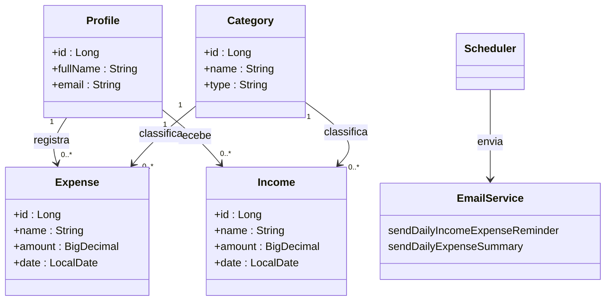

# Controle Financeiro

Sistema de controle financeiro pessoal que permite ao usuário registrar suas despesas, visualizar relatórios diários e receber resumos por e-mail.

---

##  Funcionalidades

- Cadastro e gestão de perfis de usuários (ProfileEntity)
- Registro e listagem de despesas por usuário (ExpenseDTO)
- Envio de resumo diário por e-mail utilizando agendamento (com `@Scheduled`)
---

##  Tecnologias Utilizadas

- **Java** (versão compatível com Spring Boot)
- **Spring Boot** (Web, Data JPA, Scheduling, Mail)
- **Lombok** (`@RequiredArgsConstructor`, etc.)
- **Banco de dados**: (configuração via `spring.datasource.*` — especifique qual, ex: H2, PostgreSQL, MySQL)
- **SMTP**: integração com serviço de e-mail (ex: Brevo/Smtp-relay)
- **Deployment**: Render (configuração via repositório GitHub, auto-deploy a partir da branch `main`)

---

##  Deploy no Render

1. Crie um novo **Web Service** no [Render](https://render.com/)
2. Conecte ao repositório `Controle-Financeiro` no GitHub
3. Configure os seguintes **Environment Variables**:
    - `SPRING_DATASOURCE_URL`, `SPRING_DATASOURCE_USERNAME`, `SPRING_DATASOURCE_PASSWORD`
    - `SPRING_MAIL_HOST`, `SPRING_MAIL_PORT`, `SPRING_MAIL_USERNAME`, `SPRING_MAIL_PASSWORD`
    - `SPRING_MAIL_PROPERTIES_MAIL_SMTP_FROM`
    - `SPRING_PROFILES_ACTIVE` (ex: `prod`)
4. Build Command: `./mvnw clean package`
5. Start Command: `java -jar target/<nome-do-jar>.jar`
6. Consulte os logs e testes locais acionando endpoints ou observando os e-mails agendados.

---

##  Diagrama de arquitetura (Mermaid)


Como Rodar Localmente

Faça clone do repositório:
```
Bash
git clone https://github.com/scaglia-aylla1/Controle-Financeiro.git
```

Configure o .env ou application.properties com as credenciais do banco e SMTP

Execute:
```
./mvnw spring-boot:run
```

Verifique nos logs o disparo do resumo diário — ou altere a cron para testar manualmente (por exemplo: 0 * * * * * para a cada minuto)

### Contato e Contribuição

Autor: **Aylla Scaglia**

Contato: [Linkedin](https://www.linkedin.com/in/aylla-scaglia/)

### 📝 Licença

Este projeto está sob a licença MIT. Sinta-se à vontade para utilizar, modificar e compartilhar.

Pull requests são bem-vindos! Coloque nomes, instruções de uso, bugs conhecidos, e roadmap conforme desejar.


